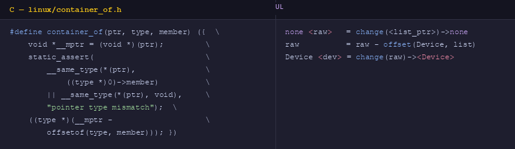

# UniLogic

**Syntax reference, safety documentation, and compiler source.**

## Live Site

| Page | URL |
|------|-----|
| Home Page | https://albazzaztariq.github.io/UniLogic/ |

## What is UniLogic?

A unified systems and application language that transpiles to C, Python, and JavaScript. Runtime behavior such as memory model, stack size, safety checks and others are settings, not just language defaults. Includes a formal memory safety proof system with verifiable certificates.

Standard mode reads like natural language. Base mode adds memory management, pointers, and bitwise operations in the same file — no mode switch, no separate language.

**Example — `container_of`.** Recovering a struct from a pointer to one of its members. A pattern used throughout the Linux kernel.

## Compiler

Requires Python 3 and clang or gcc.

## Safety

UniLogic targets mathematically proven memory safety and functional correctness via a formal verification pipeline. See the [Safety page](https://albazzaztariq.github.io/UniLogic/safety.html) for the full methodology.

## Dynamic Runtime

UniLogic exposes 10 runtime settings — memory model, allocator, overflow behaviour, stack size, bounds checking, float semantics, and more — declared per source file at compile time. See the [Runtime page](https://albazzaztariq.github.io/UniLogic/dynamic-runtime.html) for all settings.
